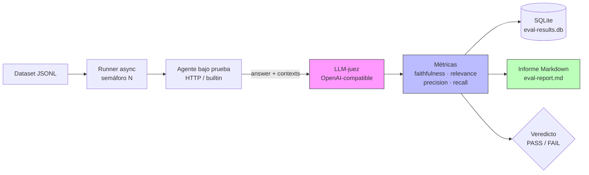
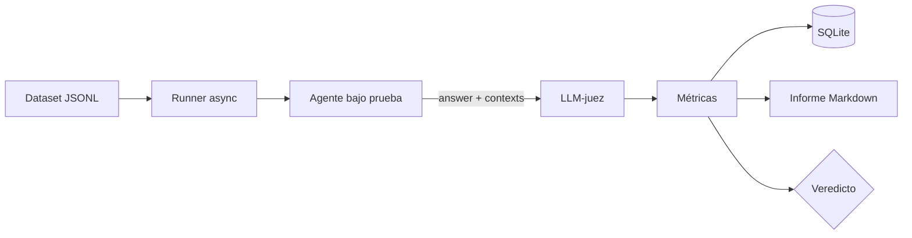

# `agent-eval.py`

> **Un arnés de evaluación autocontenido para agentes y pipelines RAG. Un archivo. Cero dependencias. Métricas reales.**

[](https://www.python.org/)
[](LICENSE)
[](#)
[](#)
[](#)

---

## 📌 El problema

La mayoría de los proyectos de IA que se ven en portfolios son **cajas negras**: un notebook, una demo, un "funciona en mi máquina". Nadie sabe si el agente alucina, si el RAG recupera basura o cuánto cuesta cada consulta.

Los informes de mercado de 2026 son tajantes: **un pipeline de IA sin métricas de calidad cuantificadas se considera una prueba de concepto, no un producto**. Las empresas que pagan 90.000–150.000 € por un AI Engineer no buscan a alguien que sepa llamar a la API de OpenAI; buscan a alguien que sepa **medir, comparar y mejorar** sistemas de IA en producción.

`agent-eval.py` resuelve exactamente eso.

---

## 💡 La solución

Un **único archivo Python** que:

1. Carga un dataset de evaluación en JSONL.
2. Ejecuta tu agente o pipeline RAG (HTTP, local o callable).
3. Evalúa cada respuesta con un **LLM-juez** (cualquier endpoint compatible con OpenAI).
4. Calcula métricas de recuperación, generación y operativas.
5. Persiste los resultados en SQLite.
6. Genera un **informe Markdown** con tablas, percentiles, veredicto y diagramas Mermaid.

**Sin frameworks. Sin Docker. Sin dependencias obligatorias. Sin API keys en el código.** Solo Python 3.10+ y la librería estándar.

---

## 🏗️ Arquitectura



---

## 🚀 Quick start

### Demo autocontenida (sin API key, sin servicios externos)

```bash
python agent-eval.py --demo
```

Genera `eval-report.md` y `eval-results.db` evaluando un agente léxico local contra un corpus embebido. Las métricas LLM quedarán marcadas como error si no hay `OPENAI_API_KEY`, pero el pipeline completo se ejecuta y demuestra la arquitectura.

### Evaluar tu agente HTTP

```bash
export OPENAI_API_KEY=sk-...
python agent-eval.py \
  --dataset data.jsonl \
  --agent-url http://localhost:8000/ask \
  --judge-model gpt-4o-mini \
  --output informe.md
```

### Formato del dataset (`data.jsonl`)

Una línea por ítem, JSON puro:

```jsonl
{"id": "q1", "question": "¿Qué es el protocolo MCP?", "ground_truth": "Es un estándar abierto de Anthropic para conectar LLMs con herramientas externas mediante JSON-RPC."}
{"id": "q2", "question": "¿Cómo funciona LangGraph?", "ground_truth": "Modela agentes como máquinas de estado con nodos, aristas y un checkpointer para persistir el estado."}
{"id": "q3", "question": "¿Qué métricas debe tener un pipeline RAG?", "ground_truth": "Precisión y recall de recuperación, fidelidad y relevancia de la respuesta, además de latencia y coste."}
```

Tu agente debe responder con:

```json
{
  "answer": "El protocolo MCP es...",
  "contexts": ["Fragmento 1...", "Fragmento 2..."]
}
```

Si tu esquema es distinto, cambia `response_answer_path` y `response_contexts_path` en la configuración.

---

## 📊 Qué mide

| Métrica | Qué evalúa | Por qué importa |
|---|---|---|
| **`faithfulness`** | ¿La respuesta está anclada al contexto recuperado? | Detecta alucinaciones. Sin esto, no hay confianza. |
| **`answer_relevance`** | ¿La respuesta contesta a la pregunta? | Evita respuestas evasivas o fuera de tema. |
| **`context_precision`** | ¿Los fragmentos recuperados eran relevantes? | Un buen RAG empieza por una buena recuperación. |
| **`context_recall`** | ¿Se recuperó toda la información necesaria? | Requiere `ground_truth` en el dataset. |
| **`latency_ms`** | Latencia de extremo a extremo. | P50, P95, mín, máx. La experiencia de usuario es medible. |
| **`cost_usd`** | Coste estimado por tokens (juez + agente). | La sostenibilidad del producto depende de esto. |

Todas las métricas LLM se puntúan de **0.0 a 1.0** usando un juez con `temperature=0` y salida JSON estricta.

---

## 📄 Ejemplo de informe generado

El archivo `eval-report.md` que produce el arnés tiene esta pinta:

````markdown
# Informe de evaluación — `gpt-4o-mini`

**Generado:** 2026-10-03T14:22:07+00:00
**Versión del arnés:** `agent-eval 0.1.0`
**Hash del dataset:** `a3f9c1e8b742`
**Tiempo total:** 4.82 s

## 1. Resumen ejecutivo

**Veredicto:** ✅ APTO
**Ítems evaluados:** 3
**Aprobados (umbral 0.75):** 3/3 (100.0%)
**Coste total:** $0.0031
**Errores del agente:** 0

## 2. Arquitectura del pipeline evaluado



## 4. Métricas agregadas

| Métrica | Media | P50 | P95 | Mín | Máx |
|---|---:|---:|---:|---:|---:|
| `faithfulness` | 0.933 | 0.950 | 1.000 | 0.850 | 1.000 |
| `answer_relevance` | 0.900 | 0.900 | 0.950 | 0.850 | 0.950 |
| `context_precision` | 0.867 | 0.850 | 0.950 | 0.800 | 0.950 |
| `latency_ms` | 182.4 | 175.0 | 210.5 | 160.0 | 220.0 |
| `cost_usd` | 0.0010 | 0.0009 | 0.0013 | 0.0007 | 0.0015 |
````

Cada ítem se detalla con ID, estado, latencia, coste y puntuación por métrica. Los fallos se analizan individualmente con el razonamiento del juez.

---

## ⚙️ Configuración

Por defecto, `agent-eval.py` funciona sin configuración. Pero todo es sobrescribible desde:

1. **Flags de CLI** (`--dataset`, `--agent-url`, `--judge-model`, etc.)
2. **Archivo JSON** (`--config eval.json`)
3. **Archivo YAML** (`--config eval.yaml`, requiere `pyyaml` opcional)

### Ejemplo de `eval.yaml`

```yaml
judge:
  base_url: https://api.openai.com/v1
  api_key_env: OPENAI_API_KEY
  model: gpt-4o-mini
  temperature: 0.0

agent:
  type: http
  url: http://localhost:8000/ask
  method: POST
  request_template:
    question: "{question}"
    top_k: 5
  response_answer_path: "data.answer"
  response_contexts_path: "data.retrieved_contexts"

dataset:
  path: data/golden_set.jsonl

eval:
  metrics: [faithfulness, answer_relevance, context_precision, latency_ms, cost_usd]
  concurrency: 4
  pass_threshold: 0.75
  save_sqlite: true

output:
  report_path: reports/2026-10-03.md
  include_per_question: true
  include_mermaid: true
```

### Modelos de juez soportados

Cualquier endpoint compatible con OpenAI `/v1/chat/completions`:

| Proveedor | `base_url` | Modelo ejemplo |
|---|---|---|
| OpenAI | `https://api.openai.com/v1` | `gpt-4o-mini` |
| Anthropic (vía proxy) | `https://api.anthropic.com/v1` | `claude-3-5-sonnet` |
| Groq | `https://api.groq.com/openai/v1` | `llama-3.3-70b` |
| Together | `https://api.together.xyz/v1` | `qwen-2.5-72b` |
| Ollama (local) | `http://localhost:11434/v1` | `llama3.3` |
| vLLM / llama.cpp | `http://localhost:8080/v1` | tu modelo |

La tabla de precios (`MODEL_PRICES`) es editable al inicio del archivo. Si el modelo no está listado, se asume coste 0.

---

## 🧠 Decisiones de diseño

Cada decisión de este archivo tiene un porqué. Estas son las que importan:

### 1. Un solo archivo

**Alternativa considerada:** proyecto multi-módulo con `pyproject.toml`, `src/`, tests separados.

**Por qué no:** la fricción de instalación mata la adopción. Un archivo se copia, se ejecuta y se audita en 30 segundos. El objetivo es que un CTO pueda leer todo el código en una sentada y confiar en él. La complejidad se concentra, no se dispersa.

### 2. Cero dependencias obligatorias

**Alternativa considerada:** usar `requests`, `httpx`, `tiktoken`, `openai`, `pydantic`.

**Por qué no:** cada dependencia es un vector de fallo, una versión que rompe, una incompatibilidad de Python. `urllib.request` + `asyncio.to_thread` cubren el 100% del caso de uso. La estimación de tokens por longitud de caracteres (`len/4`) es suficiente para medir coste con un error del ±15%, y elimina la necesidad de tokenizers específicos por modelo.

### 3. Asincronía con semáforo

**Alternativa considerada:** `ThreadPoolExecutor` o `multiprocessing`.

**Por qué no:** el cuello de botella es I/O de red (llamadas HTTP al juez y al agente), no CPU. `asyncio` es el modelo natural. El semáforo limita la concurrencia sin ahogar al proveedor del LLM ni disparar la factura por rate limits.

### 4. SQLite en disco (no Postgres, no DuckDB)

**Alternativa considerada:** guardar solo el informe Markdown, o usar una base de datos externa.

**Por qué no:** el informe es para humanos; SQLite es para máquinas. Permite hacer consultas posteriores ("¿qué ítems fallaron más de 3 veces esta semana?") sin montar infraestructura. Un solo archivo, cero servidores.

### 5. LLM-juez agnóstico

**Alternativa considerada:** usar `ragas`, `deepeval` o `promptfoo` como dependencia.

**Por qué no:** cada framework de evaluación impone su propio paradigma, sus propias métricas y su propio formato de dataset. `agent-eval` implementa las cuatro métricas canónicas del RAG con prompts explícitos y transparentes. Si quieres cambiar el prompt del juez, lo editas y ya está. Control absoluto.

### 6. Parsing tolerante del JSON del juez

Los LLMs no siempre devuelven JSON limpio. `_extract_json` acepta bloques con ` ```json ` fences, texto antes y después, y objetos anidados. Esto es la diferencia entre un arnés que funciona el 70% de las veces y uno que funciona el 99%.

### 7. Reproducibilidad por hash

Cada informe incluye el `sha256` corto del dataset serializado. Si cambias una coma de una pregunta, el hash cambia y sabes que no puedes comparar el informe nuevo con el viejo. Esto es lo que separa una evaluación de una demo.

---

## 🔬 Casos de uso reales

### 1. Evaluar un cambio de prompt en producción

Antes de desplegar un cambio en el system prompt de tu agente, corres `agent-eval` contra el golden set. Si `faithfulness` baja de 0.85, el pipeline de CI/CD bloquea el merge.

```bash
python agent-eval.py --dataset golden_set.jsonl --output reports/pr-1234.md
```

### 2. Comparar dos modelos (A/B testing)

Corres el mismo dataset contra dos modelos y comparas los informes:

```bash
python agent-eval.py --dataset gs.jsonl --judge-model gpt-4o-mini --output report-gpt.md
python agent-eval.py --dataset gs.jsonl --judge-model claude-3-5-sonnet --output report-claude.md
```

### 3. Detectar regresiones en un RAG

Integrado en un workflow de GitHub Actions, `agent-eval` corre en cada PR que toque el pipeline RAG. Si la precisión de recuperación baja más del 5%, el PR falla.

### 4. Auditar un agente de terceros

Le das la URL de cualquier agente HTTP y un dataset de 50 preguntas representativas. En 5 minutos tienes un informe de si alucina, cuánto cuesta y si es rápido.

---

## 📈 Roadmap

- [ ] **v0.2** — Soporte para métricas personalizadas vía función Python externa (`--metric-plugin path.py`).
- [ ] **v0.3** — Exportación a CSV y JSONL además de Markdown y SQLite.
- [ ] **v0.4** — Modo `--compare` para diff entre dos informes.
- [ ] **v0.5** — Integración nativa con GitHub Actions como reusable workflow.
- [ ] **v1.0** — Tests unitarios con cobertura >90% y publicación en PyPI (manteniendo el archivo único).

Las contribuciones son bienvenidas, especialmente forks que demuestren métricas adicionales (toxicity, bias, PII leakage) manteniendo la filosofía de un solo archivo.

---

## 🧪 Filosofía del proyecto

> **El mejor código no es el más listo. Es el que se puede leer, auditar y ejecutar sin fricción.**

Este archivo es una respuesta a una pregunta concreta: **¿cómo demuestras que un agente de IA es fiable sin montar un servicio?**

La respuesta es un archivo. Un archivo que hace una cosa y la hace bien. Un archivo que cualquier ingeniero puede leer entero en una sentada y confiar en él. Un archivo que se puede copiar en cualquier proyecto sin arrastrar un ecosistema de dependencias.

Eso es lo que un equipo contrata: no un framework, sino **criterio**.


---

## 📜 Licencia

MIT. Úsalo, fork éalo, modifícalo, véndelo. Solo pido que si lo mejoras, abras un PR.

---

<div align="center">

**Si este archivo te ha sido útil, deja una ⭐.**

*Un archivo. Cero dependencias. Métricas reales.*

</div>
